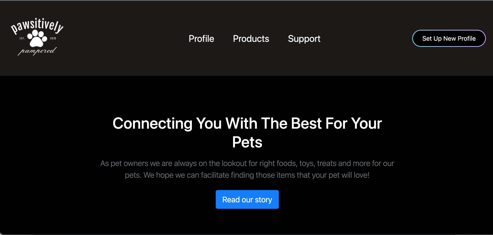
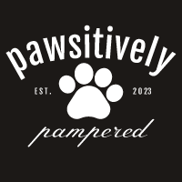

# Pawsitively-Pampered

  ## Description:
Find all of your pets needs in one simple to use app. Browse our carefully curated selection for the finest pet toys, treats, accessories and more! Our motivation for our group project was to create an e-commerce pet website that provides a profile for your pet, products page for pets and support page. We built this to write a collaborative frontend and backend website with GET , POST, PUT and DELETE Routes. We also used tailwind as a technology that would provide a nice design. Also going into this we had to use mySQL for the database and use also used handlebars to link frontend data to the backend. In doing so we learned how to work together as a team. Help each other when we get stuck on different bugs. Overall work unite on workind different sections.

  ## Table of Contents:
- [Pawsitively-Pampered](#pawsitively-pampered)
  - [Description:](#description)
  - [Table of Contents:](#table-of-contents)
  - [Installation](#installation)
  - [Usage](#usage)
  - [License](#license)
  - [Contributions](#contributions)
  - [Screen Shot](#screen-shot)
- [LINKS](#links)
  - [Repo](#repo)

 ## Installation
*The installations necessary for this project would be : Node Modules, Handlebars, Dotenv, mySQL

> npm i

> npm i dotenv

> npm i handlebars

> Your mySQL Login

 ## Usage 
This site can be used as a reference for building an ecommerce website.

 ## License 
  MIT License

 ## Contributions 
  Zeus Cordeiro (Frontend Dev), Manuel Rodriguez (Frontend Dev), Adrian Bruno (Frontend Dev), Max Fell (Backend Dev), Rose Black (Backend Dev), Gerardo Ormeno (Backend Dev)

 ## Screen Shot
 

# LINKS

 ## Repo 

 [Pawsitively Pampered Link](https://github.com/Pets-Project/Pawsitively-Pampered)

 [Heroku Link](https://sleepy-cove-33031.herokuapp.com)
  

